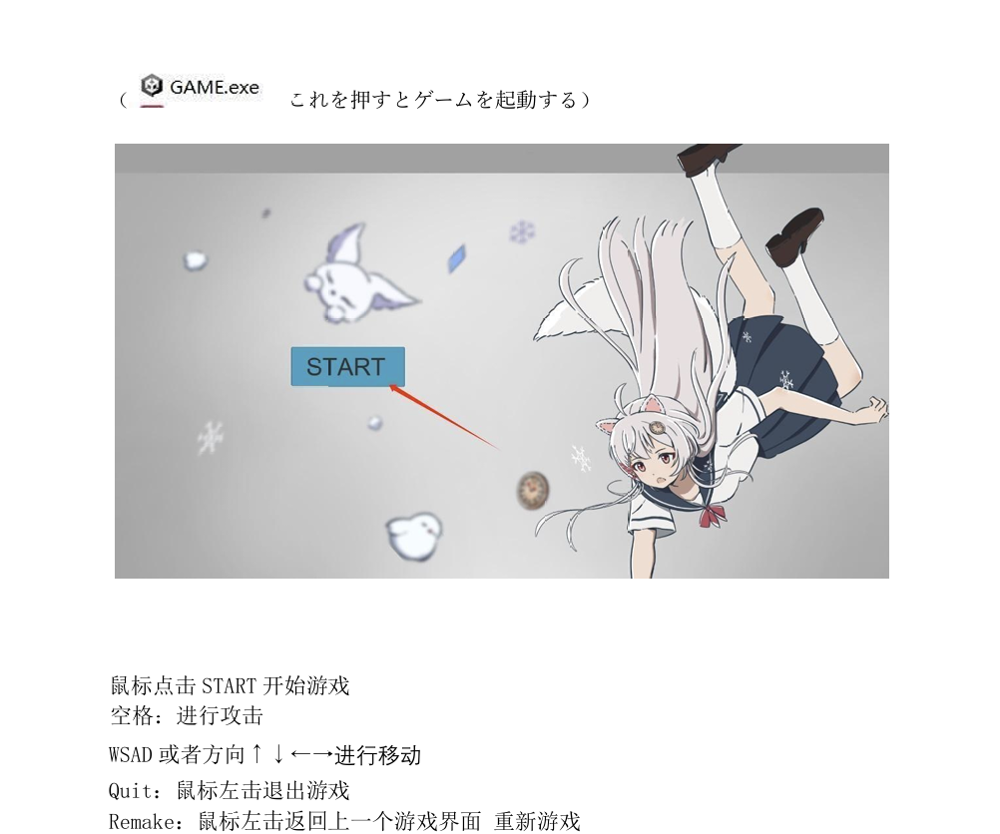
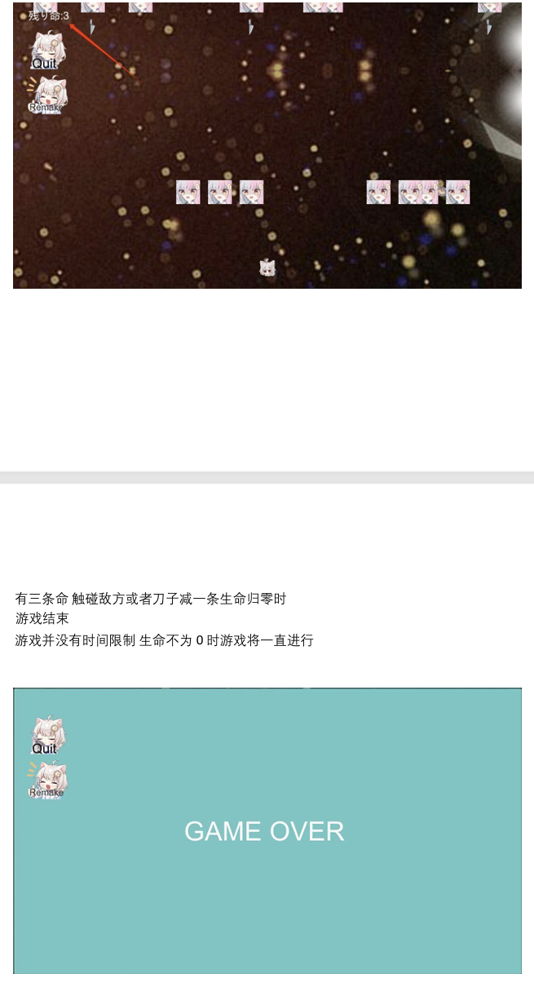
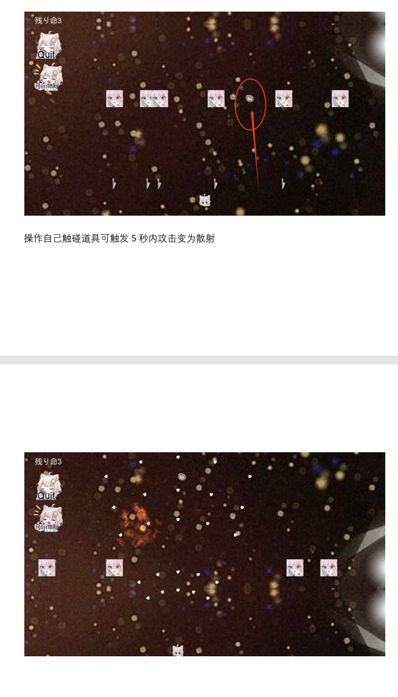

# xuehugame

unityで作られたゲームだ。画像素材は本人の許可を持った。「雪狐桑」と言うVUPの公式サイトからもらった。画像素材の使用範囲は営利目的以外。

# 運行方法

雪狐小游戏 と言うフォルダをダウンロードして、GAME.exeをクリック

# 遊び方法

マウスで「START」をクリックしてゲーム開始

スペースキー：攻撃する

WASD または矢印キー ↑ ↓ ← →：移動する

Quit：マウスの左クリックでゲームを終了する

Remake：マウスの左クリックで前のゲーム画面に戻り、ゲームを再開する

ライフは3つあります。敵やナイフに触れるとライフが1つ減り、ライフが0になるとゲーム終了です。

このゲームには時間制限はありません。ライフが0にならない限り、ゲームは続きます。

操作キャラクターが道具に触れると、5秒以内に攻撃が拡散攻撃になります。

